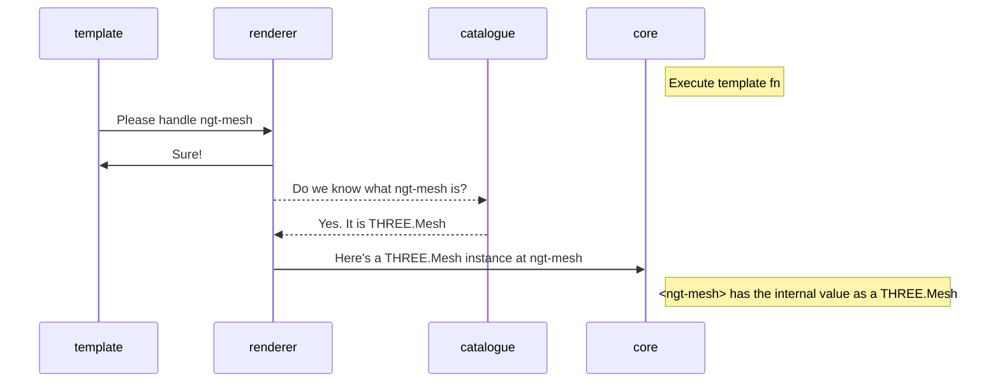
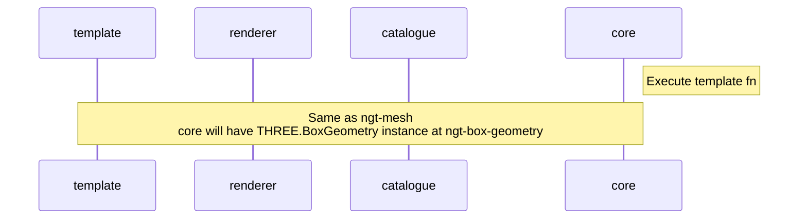
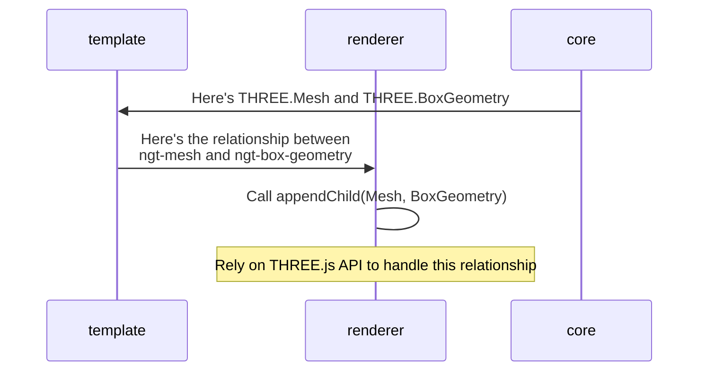
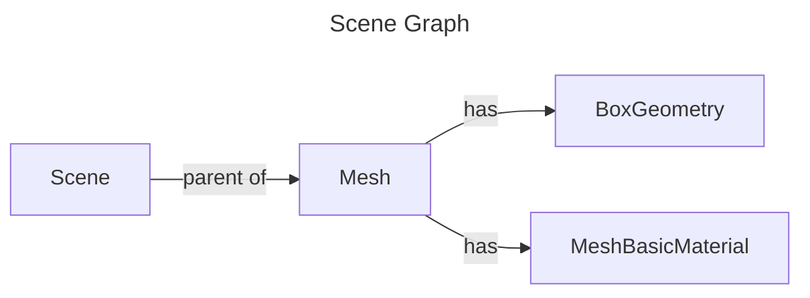
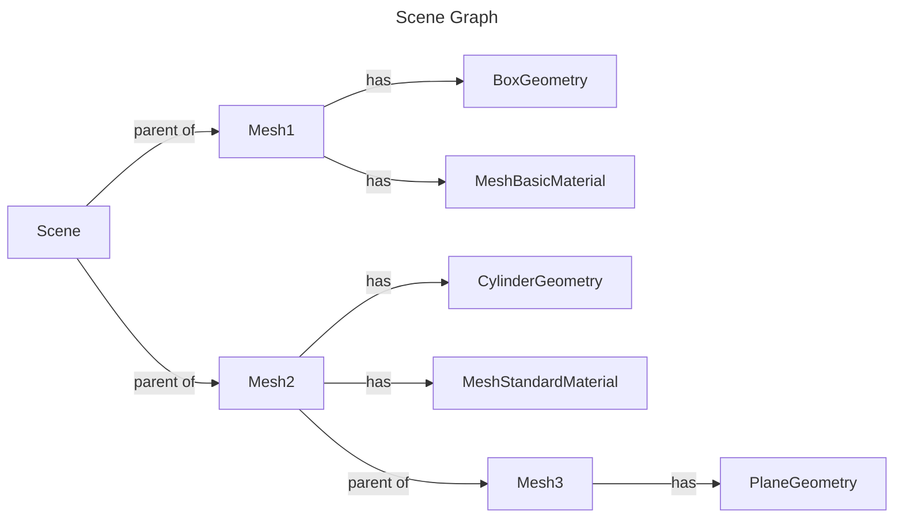
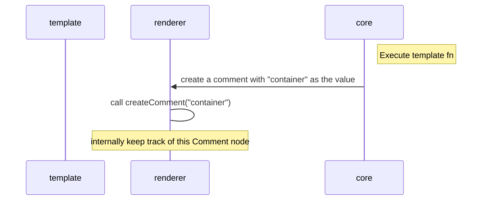
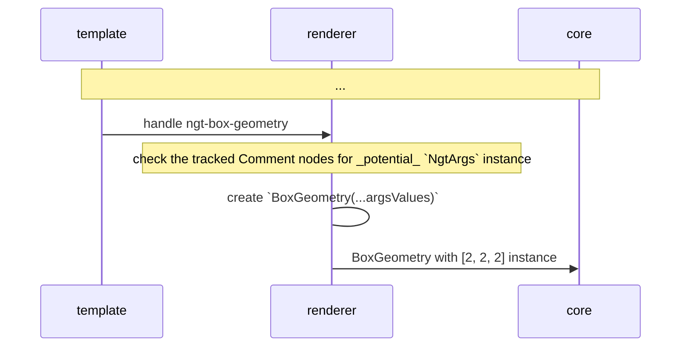

---
# You can also start simply with 'default'
theme: default
# some information about your slides (markdown enabled)
title: Learn Angular Three via live-coding
class: text-center font-xl
highlighter: shiki
transition: slide-left
mdc: true
---

# Learn Angular Three

# via live-coding

https://github.com/angular-threejs/angular-three

<!--
The last comment block of each slide will be treated as slide notes. It will be visible and editable in Presenter Mode along with the slide. [Read more in the docs](https://sli.dev/guide/syntax.html#notes)
-->

---

# Chau Tran

## Engineer at Nx

## nartc.me | @nartc1410

---
transition: fade-out
---

# What is Angular Three?

<v-click>

##### (_definitely_ **NOT** the missing Angular 3)

</v-click>

<br/>
<br/>

<v-click>

## Angular Three is a custom <span v-mark.orange>**Renderer**</span>

<br/>
<br/>

## that renders <span v-mark.circle.orange>**THREE.js**</span> to the Canvas

<br/>
<br/>

## using the <span v-mark.orange>_declarative_ Angular Template.</span>

</v-click>

<!--
Here is another comment.
-->

---
class: flex justify-center items-center
---

# Demo

---

# NgtCanvas

<br>
<br>

<v-click>

- Build the building block for THREE.js: `WebGLRenderer`, `Camera`, and `Scene`

</v-click>

<v-click>

- Set up Resize listener

</v-click>

<v-click>

- Set up the Event system using `Raycaster`

</v-click>

<v-click>

- Provide the custom `Renderer` for the `[sceneGraph]`

</v-click>

---

# Catalogue

<v-click>

````md magic-move
```ts {all|1|2|4|all}
import { extend } from "angular-three";
import * as THREE from "three";

extend(THREE);
```

```ts {all|2|4|all}
import { extend } from "angular-three";
import { Mesh, MeshBasicMaterial } from "three";

extend({ Mesh, MeshMasicMaterial });
```

```ts
import { extend } from "angular-three";
import { Mesh, MeshBasicMaterial } from "three";

extend({ Mesh, MeshMasicMaterial });
// Mesh - ngt-mesh
// MeshBasicMaterial - ngt-mesh-basic-material
```

```ts
import { extend } from "angular-three";
import { Mesh, MeshBasicMaterial } from "three";

extend({ Mesh, MyBasicMaterial: MeshMasicMaterial });
// Mesh - ngt-mesh
// MyBasicMaterial - ngt-my-basic-material
```
````

</v-click>

<v-click>

`extend` can be called multiple times
and will always extend a global `catalogue`

</v-click>

<!--
Notes can also sync with clicks

[click] This will be highlighted after the first click

[click] Highlighted with `count = ref(0)`

[click:3] Last click (skip two clicks)
-->

---

# Flow: Simple

```angular-html {all|1,4}
<ngt-mesh>
  <ngt-box-geometry />
  <ngt-mesh-basic-material />
</ngt-mesh>
```

<v-click>



</v-click>

---

# Flow: Simple (cont.)

```angular-html {all|2}
<ngt-mesh>
  <ngt-box-geometry />
  <ngt-mesh-basic-material />
</ngt-mesh>
```

<v-click>



</v-click>

---

# Flow: Simple (cont.)

```angular-html {all|1,2,4}
<ngt-mesh>
  <ngt-box-geometry />
  <ngt-mesh-basic-material />
</ngt-mesh>
```

<v-click>



</v-click>

---

# Flow: Simple (cont.)

<v-click>



</v-click>

---

# Flow: Simple (cont.)

<v-click>



</v-click>

---

# Flow: Simple (cont.)

<div v-click class="h-full flex items-center">

```angular-html
<ngt-mesh name="Mesh1">
  <ngt-box-geometry />
  <ngt-mesh-basic-material />
</ngt-mesh>

<ngt-mesh name="Mesh2">
  <ngt-cylinder-geometry />
  <ngt-mesh-standard-material />

  <ngt-mesh name="Mesh3">
    <ngt-plane-geometry />
  </ngt-mesh>
</ngt-mesh>
```

</div>

---

# Internal Entities

<v-click>

````md magic-move
```angular-ts
@Component({
    template: `
        <ngt-mesh>
            <!-- ... -->
        </ngt-mesh>
    `
})
export class Scene {}
```

```angular-ts
@Component({
    template: `
        <ngt-mesh #mesh>
            <!-- ... -->
        </ngt-mesh>
    `
})
export class Scene {}
```

```angular-ts
@Component({
    template: `
        <ngt-mesh #mesh>
            <!-- ... -->
        </ngt-mesh>
    `
})
export class Scene {
    mesh = viewChild.required<ElementRef<Mesh>>("mesh");
}
```

```angular-ts
@Component({
    template: `
        <ngt-mesh #mesh>
            <!-- ... -->
        </ngt-mesh>
    `
})
export class Scene {
    mesh = viewChild.required<ElementRef<Mesh>>("mesh");

    constructor() {
        injectBeforeRender(() => {
            const mesh = this.mesh().nativeElement;
            //      ^? Mesh
            mesh.rotation.x += 0.01;
            mesh.rotation.y += 0.01;
        })
    }
}
```
````

</v-click>

---

# Structural Directive

````md magic-move
```angular-html
<ngt-box-geometry *args="[2, 2, 2]" />
```

```angular-html
<ng-template [args]="[2, 2, 2]">
    <ngt-box-geometry />
</ng-template>
```

```angular-html
<!-- comment: container -->
    <!-- BoxGeometry -->
```
````

---

# Structural Directive (cont.)



---

# Structural Directive (cont.)



---

# Structural Directive (cont.)

<br>
<br>

<v-click>

`NgtArgs` is a Structure Directive so

</v-click>

<v-click>

`ViewContainerRef` and `TemplateRef` business to create and destroy the template

</v-click>

---

<div class="h-full flex justify-center items-center">

# Thank you

</div>

<PoweredBySlidev />
